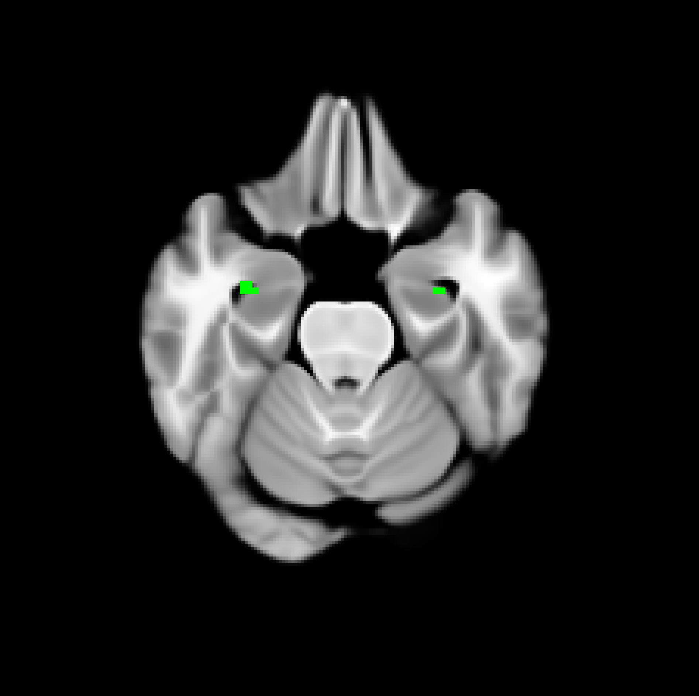

# Explainable Brain Age

This repository contains a small BIDS-oriented pipeline for running the ANTsPyNet
DeepBrainNet brain-age model on T1-weighted MRI images and writing salience maps
that can be inspected alongside the predicted brain age.

The project has two scripts:

- `brain_age_salience_bids.py`: user-facing command-line wrapper for BIDS datasets.
- `brain_age_salience.py`: standalone single-image CLI and importable backend
  function that loads the ANTsPyNet brain-age model, optionally preprocesses a
  T1 image, and computes vanilla gradients and optional SmoothGrad salience
  maps.

This code is intended for research and reproducible analysis workflows. It is not
intended for clinical diagnosis or individual medical decision-making.

## Example Figure



## What the Pipeline Does

For each T1w image, the pipeline can:

1. Run ANTsPyNet T1 preprocessing, including brain extraction, bias correction,
   denoising, and registration to the cropped MNI152 template.
2. Apply the pretrained ANTsPyNet `brainAgeDeepBrainNet` model slice-by-slice.
3. Summarize brain age with the differentiable mean head by default, or use
   `--median-head` to fall back to the original ANTsPyNet median of slice-wise
   predictions.
4. Write vanilla gradient salience maps.
5. Optionally write SmoothGrad salience maps with brain-masked noise and/or
   affine augmentation averaging.

## Installation

The recommended setup is a conda environment:

```bash
conda env create -f environment.yml
conda activate explainable-brain-age
python brain_age_salience_bids.py --help
```

Alternatively, install the pinned pip requirements in your own Python 3.8
environment:

```bash
pip install -r requirements.txt
```

ANTsPyNet may download pretrained weights/templates the first time the pipeline
runs, so the first run may require internet access and can take longer than later
runs.

## Expected Input

The BIDS wrapper expects a BIDS-style T1w image:

```text
bids_root/
  sub-001/
    ses-01/
      anat/
        sub-001_ses-01_T1w.nii.gz
```

Session and run labels are optional when they are not present in the dataset.
Labels can be passed with or without BIDS prefixes, so `001` and `sub-001` are
equivalent.

## Quick Start

Run preprocessing from a raw BIDS T1w image:

```bash
python brain_age_salience_bids.py /path/to/bids sub-001 --session ses-01 --do_preprocessing
```

Reuse the saved preprocessed T1 image and add SmoothGrad:

```bash
python brain_age_salience_bids.py /path/to/bids 001 --session 01 --n-smooth 25 --mask-noise
```

When `--do_preprocessing` is omitted, the input must already be preprocessed by
ANTsPyNet `brain_age` or by this brain-age salience pipeline. Arbitrary T1
preprocessing will not produce the expected model input.

Analyze a specific ANTsPyNet `brain_age`-preprocessed T1 image:

```bash
python brain_age_salience_bids.py /path/to/bids sub-001 \
  --t1-image /path/to/sub-001_desc-preproc_T1w.nii.gz
```

Use a specific BIDS run:

```bash
python brain_age_salience_bids.py /path/to/bids sub-001 --session 01 --run 02 --do_preprocessing
```

Set a seed for stochastic SmoothGrad/augmentation steps:

```bash
python brain_age_salience_bids.py /path/to/bids sub-001 --do_preprocessing --n-smooth 25 --seed 42
```

Use the original ANTsPyNet median-of-slices fallback instead of the default
mean head:

```bash
python brain_age_salience_bids.py /path/to/bids sub-001 --session 01 --median-head
```

## Main Options

| Option | Purpose |
| --- | --- |
| `--do_preprocessing` | Run ANTsPyNet preprocessing before inference. |
| `--t1-image` | Use an explicit T1 image path instead of BIDS auto-detection. |
| `--output-dir` | Write derivatives somewhere other than `bids_root/derivatives/brain_age_salience`. |
| `--median-head` | Fall back to the original ANTsPyNet median of slice-wise predictions. |
| `--n-smooth` | Number of SmoothGrad noise samples. `0` disables SmoothGrad output. |
| `--sd-noise` | SmoothGrad noise standard deviation after image normalization. |
| `--mask-noise` | Restrict SmoothGrad noise to nonzero brain voxels. |
| `--n-affine` | Number of affine augmentation simulations to average. |
| `--sd-affine` | Affine transform standard deviation for augmentation. |
| `--no-slice-norm` | Save raw gradients instead of per-slice normalized gradients. |
| `--slice-start`, `--slice-stop` | Axial slice range used by the 2D brain-age model. |
| `--seed` | Optional seed for NumPy/TensorFlow stochastic operations. |

Run `python brain_age_salience_bids.py --help` for the full command-line reference.

## Outputs

By default, outputs are written to:

```text
bids_root/
  derivatives/
    brain_age_salience/
      sub-001/
        ses-01/
```

Typical output files include:

```text
sub-001_ses-01_desc-preproc_T1w.nii.gz
sub-001_ses-01_desc-Mean_brainage.json
sub-001_ses-01_desc-MeanVanilla_salience.nii.gz
sub-001_ses-01_desc-MeanSmooth25squareMaskedNoiseSmoothGrad_salience.nii.gz
```

The JSON file stores the predicted age, slice-wise predictions, input paths,
processing options, and output paths.

## Standalone Single-Image Use

For BIDS datasets, use `brain_age_salience_bids.py`. For one explicit T1 image,
`brain_age_salience.py` can run the same analysis directly:

```bash
python brain_age_salience.py /path/to/sub-001_desc-preproc_T1w.nii.gz
```

If the image has not already been preprocessed, add `--do_preprocessing`:

```bash
python brain_age_salience.py /path/to/sub-001_T1w.nii.gz --do_preprocessing
```

Run `python brain_age_salience.py --help` for the standalone command-line
reference.

## Python API

The backend can also be called directly:

```python
import ants
from brain_age_salience import brain_age_with_affine_smoothgrad_unified

t1 = ants.image_read("sub-001_desc-preproc_T1w.nii.gz")
result = brain_age_with_affine_smoothgrad_unified(
    t1,
    do_preprocessing=False,
    smooth_samples=25,
    mask_noise=True,
    random_seed=42,
)

print(result["predicted_age"])
result["vanilla_salience"].to_file("sub-001_desc-vanilla_salience.nii.gz")
```

## Reproducibility Notes

- Save the exact command used for each analysis.
- Keep the generated JSON metadata with every salience map.
- Use `--seed` to stabilize NumPy/TensorFlow stochastic steps. Affine
  augmentation may also depend on ANTs internals, so keep the generated metadata
  with the output files.
- The first ANTsPyNet run may download model weights/templates; record package
  versions with `conda env export --from-history` or `pip freeze` for archived
  conference analyses.

## License

This project is released under the MIT License. See `LICENSE`.

## Repository Hygiene

The `.gitignore` excludes local BIDS data, derivatives, NIfTI images, model
weights, and common Python/macOS artifacts. This keeps protected imaging data and
large generated files out of GitHub while leaving room to add code, documentation,
figures, and conference result summaries later.
