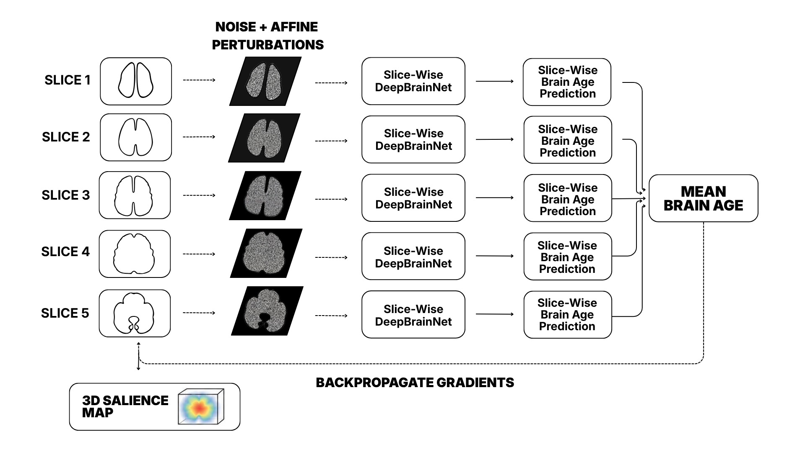
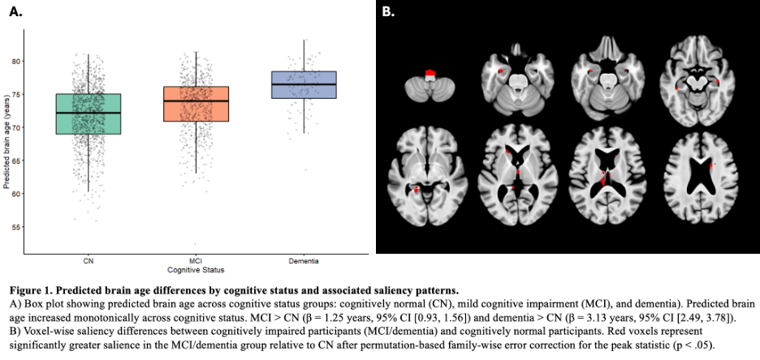

# Explainable Brain Age

A research pipeline for running explainable brain-age inference on T1-weighted
MRI scans using the ANTsPyNet implementation of DeepBrainNet. The pipeline wraps
a slice-wise brain-age model with a differentiable subject-level prediction head
and propagates gradients back to the input image to generate salience maps.

This project was developed to support biomarker-oriented neuroimaging analyses:
rather than reporting only a single predicted brain age, it also exports
voxel-wise attribution maps that help interrogate which anatomical image features
contribute to elevated brain-age estimates.


## Methods Overview



The pipeline builds on the ANTsPyNet / DeepBrainNet brain-age model, which is
based on the deep brain network described by Bashyam et al. for MRI-derived
brain-age and disease signatures. The original model operates slice-wise on
structural MRI and summarizes slice-level predictions into a subject-level
brain-age estimate.

This repository adds an explainability layer for subject-level salience mapping:

1. Load and preprocess a T1-weighted MRI using ANTsPyNet-compatible preprocessing.
2. Apply the pretrained slice-wise DeepBrainNet brain-age model.
3. Attach a differentiable mean head across slice-wise predictions.
4. Backpropagate the subject-level predicted brain age to the input slices.
5. Export vanilla gradient salience maps and optional SmoothGrad salience maps.
6. Reconstruct salience maps as 3D NIfTI images for downstream neuroimaging
   analysis.

The differentiable mean-head is the key implementation step: it makes the
participant-level brain-age estimate differentiable with respect to the input
image, allowing voxel-wise salience to be computed for the predicted brain age
rather than only for isolated slice-level outputs.

## Novelty

Most brain-age workflows report a predicted age or brain-age delta as a global
imaging-derived marker. That scalar can be sensitive to neurodegeneration, but
it is anatomically non-specific: many spatially distributed aging-related or
disease-related features can produce a similarly elevated predicted age.

This project extends a pretrained slice-wise brain-age model into an
interpretable biomarker pipeline by:

- preserving the original pretrained ANTsPyNet / DeepBrainNet model weights;
- adding a differentiable subject-level mean-prediction head for attribution;
- computing gradient-based salience for the subject-level brain-age estimate;
- supporting SmoothGrad to reduce noisy voxel-wise gradients;
- exporting salience maps as neuroimaging-compatible NIfTI derivatives;
- retaining slice-wise predictions as a QA signal to detect obvious model or
  preprocessing failures.

This makes the pipeline useful not only for estimating brain age, but also for
asking where in the image the model is deriving evidence for an older-appearing
brain.


## Conference Application



This code was used for an OHBM conference analysis examining predicted brain age
and salience-map differences across cognitive status in older adults from the
ARIC study. In that work, the brain-age model was applied to structural MRI from
1,966 participants. Predicted brain age increased monotonically across cognitive
status, with higher estimates in mild cognitive impairment and dementia relative
to cognitively normal participants after adjustment for chronological age and
sex.

Group-level salience analyses identified differences in ventricular and
periventricular regions adjacent to medial temporal, limbic, striatal, and
brainstem structures. These findings illustrate the value of XAI for brain-age
biomarker development: salience mapping can reveal regionally specific image
features associated with elevated brain-age estimates, while also exposing model
dependencies on high-contrast CSF-adjacent anatomy.

## Background

DeepBrainNet was introduced as a deep learning model for MRI-derived brain-age
estimation and disease-related imaging signatures. ANTsPyNet provides a
TensorFlow/Keras implementation that can be applied to T1-weighted MRI images.
This repository uses that pretrained model as the prediction backbone and adds
a salience-mapping layer around it.

SmoothGrad is a gradient-based explanation method that averages sensitivity maps
over noisy perturbations of the input image, often producing visually cleaner
salience maps than raw gradients. In this repository, SmoothGrad is adapted to
the brain-age setting by propagating the differentiable subject-level prediction
back to the MRI input.

## References

1. Bashyam VM, Erus G, Doshi J, et al. MRI signatures of brain age and disease
   over the lifespan based on a deep brain network and 14,468 individuals
   worldwide. *Brain*. 2020;143(7):2312-2324. doi:10.1093/brain/awaa160

2. Smilkov D, Thorat N, Kim B, Viégas F, Wattenberg M. SmoothGrad: removing
   noise by adding noise. arXiv. 2017. doi:10.48550/arXiv.1706.03825

3. Brennan D, Walter A, Majbri A, Pike J, Gugger JJ, Schneider A. Saliency
   Mapping Reveals Imaging Signatures Associated with Elevated Brain Age in
   Older Adults with Cognitive Impairment. OHBM abstract.

## Installation

The recommended setup is a conda environment:

```bash
conda env create -f environment.yml
conda activate explainable-brain-age
python brain_age_salience_bids.py --help
```

Alternatively, install the pinned pip requirements in your own Python 3.8
environment:

```bash
pip install -r requirements.txt
```

ANTsPyNet may download pretrained weights/templates the first time the pipeline
runs, so the first run may require internet access and can take longer than later
runs.

## Expected Input

The BIDS wrapper expects a BIDS-style T1w image:

```text
bids_root/
  sub-001/
    ses-01/
      anat/
        sub-001_ses-01_T1w.nii.gz
```

Session and run labels are optional when they are not present in the dataset.
Labels can be passed with or without BIDS prefixes, so `001` and `sub-001` are
equivalent.

## Quick Start

Run preprocessing from a raw BIDS T1w image:

```bash
python brain_age_salience_bids.py /path/to/bids sub-001 --session ses-01
```

Reuse the saved preprocessed T1 image and add SmoothGrad:

```bash
python brain_age_salience_bids.py /path/to/bids 001 --session 01 --do_preprocessing false --n-smooth 25 --mask-noise
```

`--do_preprocessing` defaults to `true`. Set it to `false` only when the input
is already preprocessed by ANTsPyNet `brain_age` or by this brain-age salience
pipeline. Arbitrary T1 preprocessing will not produce the expected model input.

Analyze a specific ANTsPyNet `brain_age`-preprocessed T1 image:

```bash
python brain_age_salience_bids.py /path/to/bids sub-001 \
  --t1-image /path/to/sub-001_desc-preproc_T1w.nii.gz \
  --do_preprocessing false
```

Use a specific BIDS run:

```bash
python brain_age_salience_bids.py /path/to/bids sub-001 --session 01 --run 02
```

Set a seed for stochastic SmoothGrad/augmentation steps:

```bash
python brain_age_salience_bids.py /path/to/bids sub-001 --n-smooth 25 --seed 42
```

Use the original ANTsPyNet median-of-slices fallback instead of the default
mean head:

```bash
python brain_age_salience_bids.py /path/to/bids sub-001 --session 01 --median-head
```

## Main Options

| Option | Purpose |
| --- | --- |
| `--do_preprocessing {true,false}` | Run ANTsPyNet preprocessing before inference. Defaults to `true`; use `false` only for ANTsPyNet `brain_age`-preprocessed inputs. |
| `--t1-image` | Use an explicit T1 image path instead of BIDS auto-detection. |
| `--output-dir` | Write derivatives somewhere other than `bids_root/derivatives/brain_age_salience`. |
| `--median-head` | Fall back to the original ANTsPyNet median of slice-wise predictions. |
| `--n-smooth` | Number of SmoothGrad noise samples. `0` disables SmoothGrad output. |
| `--sd-noise` | SmoothGrad noise standard deviation after image normalization. |
| `--mask-noise` | Restrict SmoothGrad noise to nonzero brain voxels. |
| `--n-affine` | Number of affine augmentation simulations to average. |
| `--sd-affine` | Affine transform standard deviation for augmentation. |
| `--no-slice-norm` | Save raw gradients instead of per-slice normalized gradients. |
| `--slice-start`, `--slice-stop` | Axial slice range used by the 2D brain-age model. |
| `--seed` | Optional seed for NumPy/TensorFlow stochastic operations. |

Run `python brain_age_salience_bids.py --help` for the full command-line reference.

## Outputs

By default, outputs are written to:

```text
bids_root/
  derivatives/
    brain_age_salience/
      sub-001/
        ses-01/
```

Typical output files include:

```text
sub-001_ses-01_desc-preproc_T1w.nii.gz
sub-001_ses-01_desc-Mean_brainage.json
sub-001_ses-01_desc-MeanVanilla_salience.nii.gz
sub-001_ses-01_desc-MeanSmooth25squareMaskedNoiseSmoothGrad_salience.nii.gz
```

The JSON file stores the predicted age, slice-wise predictions, input paths,
processing options, and output paths.

## Standalone Single-Image Use

For BIDS datasets, use `brain_age_salience_bids.py`. For one explicit T1 image,
`brain_age_salience.py` can run the same analysis directly:

```bash
python brain_age_salience.py /path/to/sub-001_desc-preproc_T1w.nii.gz --do_preprocessing false
```

If the image has not already been preprocessed, use the default preprocessing:

```bash
python brain_age_salience.py /path/to/sub-001_T1w.nii.gz
```

Run `python brain_age_salience.py --help` for the standalone command-line
reference.

## Python API

The backend can also be called directly:

```python
import ants
from brain_age_salience import brain_age_with_affine_smoothgrad_unified

t1 = ants.image_read("sub-001_desc-preproc_T1w.nii.gz")
result = brain_age_with_affine_smoothgrad_unified(
    t1,
    do_preprocessing=False,
    smooth_samples=25,
    mask_noise=True,
    random_seed=42,
)

print(result["predicted_age"])
result["vanilla_salience"].to_file("sub-001_desc-vanilla_salience.nii.gz")
```


## License

This project is released under the MIT License. See `LICENSE`.
