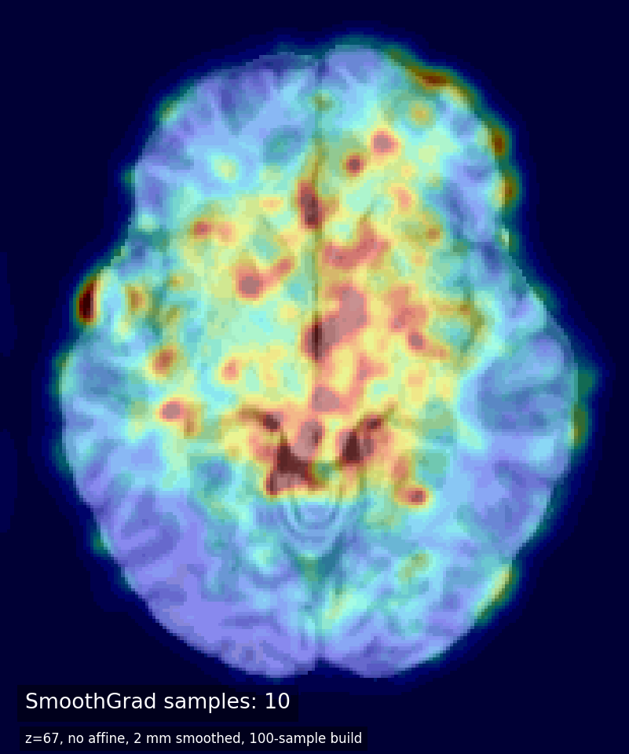

# Brain-Age Salience Mapping

This repository contains scripts for running ANTsPyNet DeepBrainNet brain-age
prediction on T1-weighted MRI and exporting salience maps for the predicted
brain age. Not intended for clinical diagnosis or individual medical decision-making.

The code provides:

- `brain_age_salience.py`: single-image command-line script and importable
  backend function.
- `brain_age_salience_bids.py`: BIDS-oriented wrapper around
  `brain_age_salience.py`.

## Methods


The pipeline:

1. Loads a T1-weighted MRI.
2. Optionally runs ANTsPyNet brain-age preprocessing.
3. Applies the pretrained ANTsPyNet DeepBrainNet brain-age model.
4. Uses a differentiable mean head across slice-wise predictions by default.
5. Backpropagates the predicted brain age to the image.
6. Writes vanilla salience maps and optional SmoothGrad salience maps as NIfTI
   images.

Use `--median-head` to fall back to the original ANTsPyNet median of slice-wise
predictions. With `--median-head`, gradients are propagated from slice-wise
brain-age predictions rather than from one participant-level brain-age
prediction.

## SmoothGrad Example

Single-slice SmoothGrad salience map from 10 to 1000 samples:



## Application in Cognitive Impairment - OHBM 2026


## Installation

```bash
conda env create -f environment.yml
conda activate explainable-brain-age
```

See `MACOS_ARM64_INSTALL_NOTES.md` for the observed `osx-arm64` installation
details. In brief: `tensorflow==2.13.0` worked where `2.13.1` did not, and
`antspyx` is installed through `pip` inside the conda environment.

Check the command-line help:

```bash
python brain_age_salience.py --help
python brain_age_salience_bids.py --help
```

ANTsPyNet may download model weights/templates on first use.

## BIDS Use

Expected input:

```text
bids_root/
  sub-001/
    ses-01/
      anat/
        sub-001_ses-01_T1w.nii.gz
```

Run the pipeline on a raw BIDS T1w image:

```bash
python brain_age_salience_bids.py /path/to/bids sub-001 --session ses-01
```

Reuse an ANTsPyNet `brain_age`-preprocessed T1 image:

```bash
python brain_age_salience_bids.py /path/to/bids sub-001 \
  --session ses-01 \
  --do_preprocessing false
```

Run SmoothGrad with affine simulation averaging:

```bash
python brain_age_salience_bids.py /path/to/bids sub-001 \
  --session ses-01 \
  --n-affine 10 \
  --n-smooth 25 \
  --mask-noise
```

Use a specific T1 image:

```bash
python brain_age_salience_bids.py /path/to/bids sub-001 \
  --t1-image /path/to/sub-001_desc-preproc_T1w.nii.gz \
  --do_preprocessing false
```

`--do_preprocessing` defaults to `true`. Set it to `false` only when the input
has already been preprocessed by ANTsPyNet `brain_age` or this pipeline.
Arbitrary T1 preprocessing will not produce the expected model input.

## Single-Image Use

Run on a raw T1 image:

```bash
python brain_age_salience.py /path/to/sub-001_T1w.nii.gz
```

Run on an ANTsPyNet `brain_age`-preprocessed T1 image:

```bash
python brain_age_salience.py /path/to/sub-001_desc-preproc_T1w.nii.gz \
  --do_preprocessing false
```

## Common Options

| Option | Meaning |
| --- | --- |
| `--do_preprocessing {true,false}` | Run ANTsPyNet preprocessing. Default: `true`. |
| `--median-head` | Use the original ANTsPyNet median of slice-wise predictions; salience is propagated slice-wise, not from a participant-level prediction. |
| `--n-smooth` | Number of SmoothGrad samples. `0` disables SmoothGrad and produces only the vanilla salience map. |
| `--sd-noise` | SmoothGrad noise standard deviation after intensity normalization. |
| `--mask-noise` | Restrict SmoothGrad noise to nonzero brain voxels. |
| `--n-affine` | Number of affine simulations to average, useful for this slice-wise model. |
| `--no-slice-norm` | Save raw gradients instead of per-slice normalized gradients. |
| `--seed` | Seed NumPy/TensorFlow stochastic steps. |

## Outputs

The BIDS wrapper writes outputs to:

```text
bids_root/derivatives/brain_age_salience/sub-001/ses-01/
```

Typical outputs:

```text
sub-001_ses-01_desc-preproc_T1w.nii.gz
sub-001_ses-01_desc-Mean_brainage.json
sub-001_ses-01_desc-MeanVanilla_salience.nii.gz
sub-001_ses-01_desc-MeanSmooth25squareMaskedNoiseSmoothGrad_salience.nii.gz
```

The JSON file contains the predicted age, slice-wise predictions, input paths,
processing options, and output paths.

When `--n-smooth 0`, no SmoothGrad file is written; only the vanilla salience
map is produced.

## Python API

```python
import ants
from brain_age_salience import brain_age_with_affine_smoothgrad_unified

t1 = ants.image_read("sub-001_desc-preproc_T1w.nii.gz")
result = brain_age_with_affine_smoothgrad_unified(
    t1,
    do_preprocessing=False,
    smooth_samples=25,
    mask_noise=True,
    random_seed=42,
)

print(result["predicted_age"])
```

## References

- Bashyam VM, Erus G, Doshi J, et al. MRI signatures of brain age and disease
  over the lifespan based on a deep brain network and 14,468 individuals
  worldwide. *Brain*. 2020;143(7):2312-2324. doi:10.1093/brain/awaa160
- Smilkov D, Thorat N, Kim B, Viegas F, Wattenberg M. SmoothGrad: removing
  noise by adding noise. arXiv. 2017. doi:10.48550/arXiv.1706.03825

## License

MIT License. See `LICENSE`.
